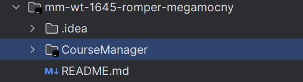
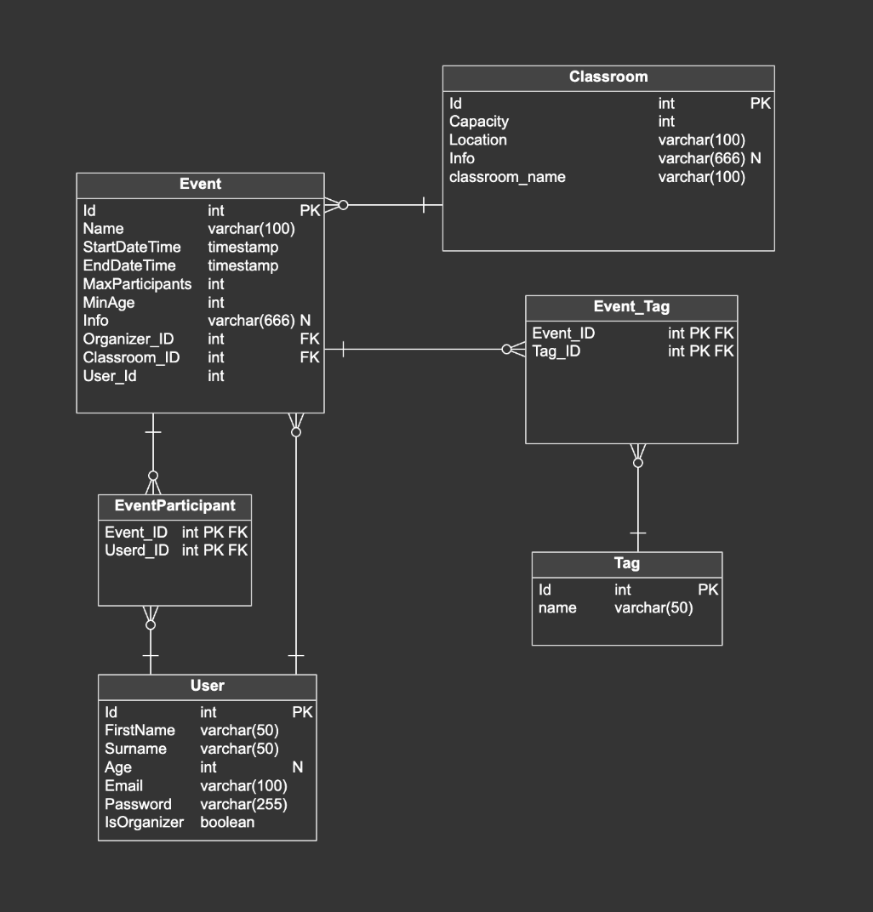

# ROMPER MEGAMOCNY

Piotr Błaszczyk, Piotr Branewski, Krzysztof Swędzioł, Michał Plaza

## Jak uruchomić:

Po zrobieniu `git clone` i pobraniu zawartości z branchu `milestone_1`  
należy w IDE otworzyć podkatalog głównego repozytorium: `CourseManager`.

Po tym dajemy Gradle'owi zbudować projekt, i po zbudowaniu  
normalnie uruchamiamy klasę `CourseManagerApplication`.

### Course Manager

---

### **Ogólny opis projektu**

Aplikacja jest stworzona w celu ułatwienia i częściowej automatyzacji procesu organizacji wydarzeń dydaktycznych takich jak kursy, webinary i podobne spotkania edukacyjne. Jest to RESTowa strona, dzięki której:

- Użytkownicy chcący podjąć aktywność mogą:
    - Sprawdzać dostępne terminy.
    - Rezerwować miejsca.
    - Podglądać wymagany sprzęt i wstępne umiejętności dla danych kursów.
    - Uzyskiwać wszystkie niezbędne informacje do udziału w zajęciach.

- Organizatorzy mogą:
    - Wyświetlać obecnie zarezerwowane terminy.
    - Dodawać własne wydarzenia.
    - Dostarczać wszelkie potrzebne informacje w celu przeprowadzenia kursu/webinaru.

---

### **Użyte technologie**

#### **Baza danych**
- **PostgreSQL**: Używany razem z Hibernate.

#### **Core projektu**
- **Spring Boot**, w tym:
    - Spring Web.
    - Spring Security.
    - Lombok.

---

### **Użyte wzorce projektowe**

1. **Dependency Injection**
    - Cel: Zwiększenie czytelności kodu, ułatwienie przeprowadzania testów jednostkowych oraz “posiadanie instrukcji tworzenia obiektów w jednym lub niewielkiej liczbie miejsc”.

2. **MVP (Model-View-Presenter)**
    - Cel: Oddzielenie logiki biznesowej od warstwy wizualnej oraz zwiększenie klarowności programu.

3. **ORM (Object-Relational Mapping)**
    - Cel: Usprawnienie komunikacji z bazą danych oraz persystencji informacji.

4. **Repository**
    - Cel: Dodanie dodatkowej warstwy abstrakcji i ukrycie odpowiedzialnego za wykonanie poszczególnych operacji kodu.

---

### **Baza Danych**

#### **Schemat bazy danych**

- **Link do schematu w Vertabelo**: [Schemat Bazy Danych](https://my.vertabelo.com/model/4aU7ztW3o2CO0RVew72ogxF35pZPsqNE)

--- 
